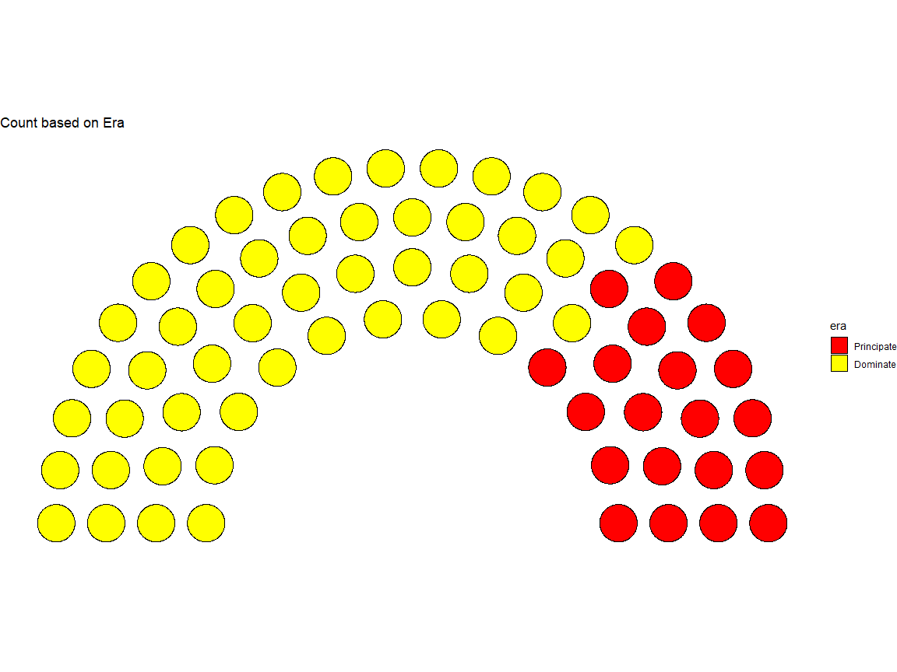
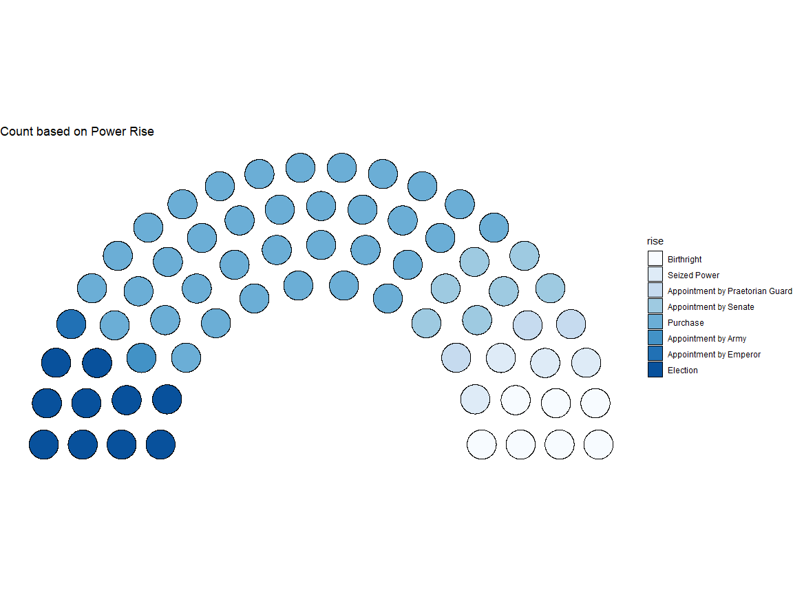
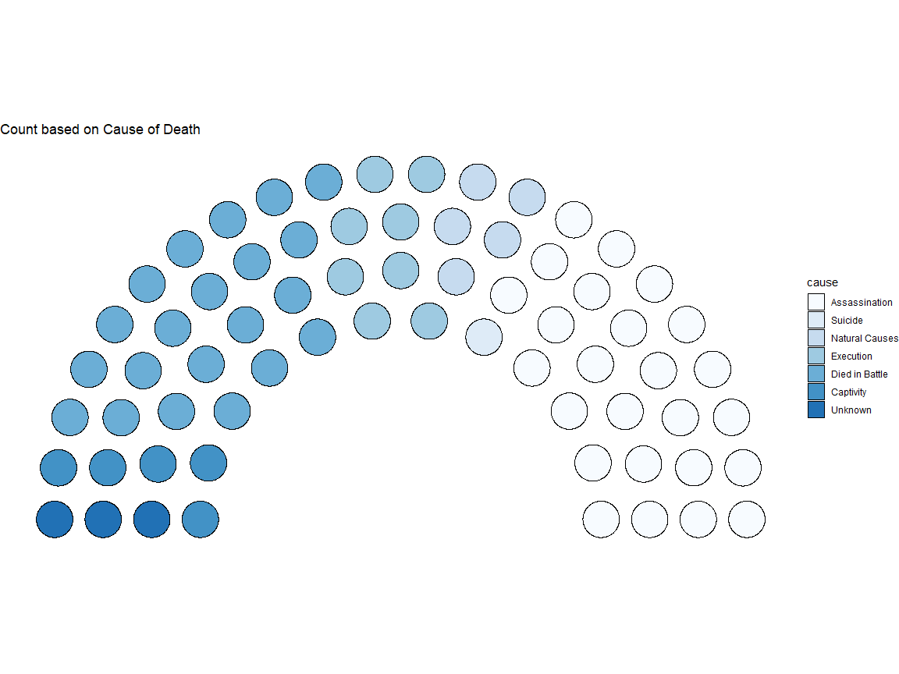
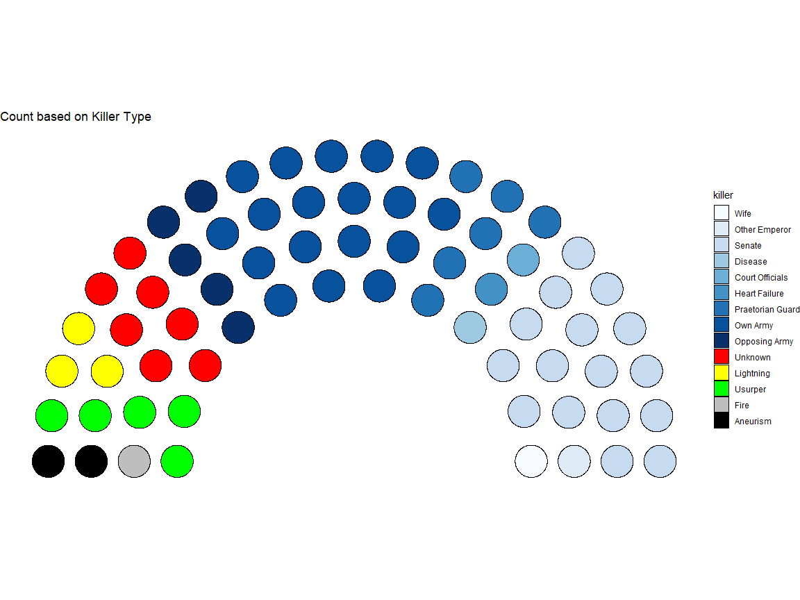
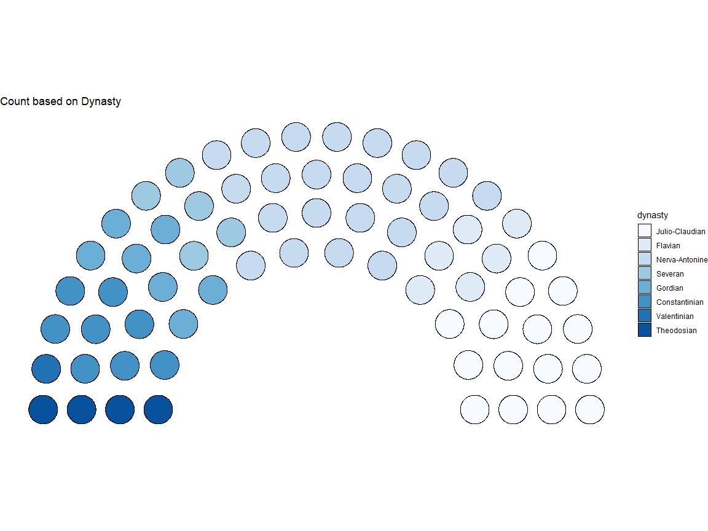

Week 33 : Emperors of Rome
================

This is a very small data frame, which is with 68 observations and 16
variables. Several plots were generated but main focus was on using the
‘ggpol’ package.

``` r
# load the data
emperors <- readr::read_csv("https://raw.githubusercontent.com/rfordatascience/tidytuesday/master/data/2019/2019-08-13/emperors.csv")

# load packages
library(ggplot2)
library(dplyr)
library(ggpol)

# load theme package
library(ggthemr)
ggthemr("flat")
```

# Birth Province

Initial plots were generated for Birth Province with mostly other
categorical variables.

``` r
emperors %>%
  group_by(birth_prv) %>%
  count(sort = TRUE) %>%
  ggplot(.,aes(birth_prv,n,label=n))+geom_col()+
  xlab("Birth Province")+ylab("Frequency")+geom_text(vjust=1)+
  ggtitle("Which Birth Province has produced more Emperors?")+
  theme(axis.text.x = element_text(angle=30,hjust=1))
```

<!-- -->

``` r
ggplot(emperors ,aes(stringr::str_wrap(birth_prv,12),stringr::str_wrap(rise,15),color=era))+
  geom_jitter(shape=15)+xlab("Birth Province")+ylab("Risen to Power")+
  ggtitle("Does Birth Province has any affect in coming to Power?")+
  theme(axis.text.x = element_text(angle=30,hjust=1))
```

<!-- -->

``` r
emperors %>%
  mutate(reign_time=reign_end-reign_start) %>%
ggplot(.,aes(stringr::str_wrap(birth_prv,12),abs(reign_time),color=era))+
  geom_jitter(shape=15)+
  xlab("Birth Province")+ylab("Days in Power")+
  ggtitle("Days in Power vs Birth Province")+
  theme(axis.text.x = element_text(angle=30,hjust=1))
```

<!-- -->

# Reign Time

Second set of plots are based on Reign Time or Time in Power with few
other categorical variables.

``` r
emperors %>%
  mutate(reign_time=reign_end-reign_start) %>%
ggplot(.,aes(stringr::str_wrap(rise,12),abs(reign_time),color=era))+
  ggtitle("Type of technique getting to power vs Days in Power")+
  geom_jitter(shape=15)+
  xlab("Rise")+ylab("Days in Power")
```

<!-- -->

``` r
emperors %>%
  mutate(reign_time=reign_end-reign_start) %>%
ggplot(.,aes(stringr::str_wrap(cause,12),abs(reign_time),color=era))+
  geom_jitter(shape=15)+
  ggtitle("Type of Death vs Days in Power")+
  xlab("Cause")+ylab("Days in Power")
```

<!-- -->

``` r
emperors %>%
  mutate(reign_time=reign_end-reign_start) %>%
ggplot(.,aes(stringr::str_wrap(dynasty,12),abs(reign_time),color=era))+
  ggtitle("Type of Dynasty vs Days in Power")+
  geom_jitter(shape=15)+
  xlab("Dynasty")+ylab("Days in Power")
```

<!-- -->

``` r
emperors %>%
  mutate(reign_time=reign_end-reign_start) %>%
ggplot(.,aes(stringr::str_wrap(era,12),abs(reign_time),color=dynasty))+
  ggtitle("Type of Era vs Days in Power")+
  geom_jitter(shape=15)+
  xlab("Era")+ylab("Days in Power")
```

<!-- -->

# Cause and Killer

``` r
ggplot(emperors,aes(cause,killer,color=era))+geom_jitter(shape=15)+
    xlab("Cause")+ylab("Killer")+
    ggtitle("Type of Death vs Main Reason to Death")
```

<!-- -->

# Days in Power vs Days Alive

``` r
emperors %>%
  mutate(reign_time=reign_end-reign_start) %>%
  mutate(alive_time=death-birth) %>%
ggplot(.,aes(abs(alive_time/365),abs(reign_time/365),color=era))+geom_point(shape=15)+
    xlab("Years Alive")+ylab("Years in Power")+
    ggtitle("Does being alive has any effect on being in power?")
```

<!-- -->

# Using ggpol package

ggpol package is used to plot parliament data. Thankfully, we can
summary the data and produce the plots as below.

## Era

``` r
# character to factor type
emperors$era<-factor(emperors$era)

emperors %>%
  count(era) %>%
ggplot(.) + 
  geom_parliament(aes(seats = n, fill = era)) + 
  scale_fill_manual(values=c("red","yellow"),labels = unique(emperors$era))+
  ggtitle("Count based on Era")+
  coord_fixed() + theme_void()
```

<!-- -->

## Risen to Power

``` r
# character to factor type
emperors$rise<-factor(emperors$rise)

emperors %>%
  count(rise) %>%
ggplot(.) + 
  geom_parliament(aes(seats = n, fill = rise)) + 
  scale_fill_manual(values=blues9,labels = unique(emperors$rise))+
  ggtitle("Count based on Power Rise")+
  coord_fixed() + theme_void()
```

<!-- -->

## Cause of Death

``` r
# character to factor type
emperors$cause<-factor(emperors$cause)

emperors %>%
  count(cause) %>%
ggplot(.) + 
  geom_parliament(aes(seats = n, fill = cause)) + 
  scale_fill_manual(values=blues9,labels = unique(emperors$cause))+
  ggtitle("Count based on Cause of Death")+
  coord_fixed() + theme_void()
```

<!-- -->

## Killer

``` r
# character to factor type
emperors$killer<-factor(emperors$killer)

emperors %>%
  count(killer) %>%
ggplot(.) + 
  geom_parliament(aes(seats = n, fill = killer)) + 
  scale_fill_manual(values=c(blues9,"red","yellow","green","grey","black"),
                    labels = unique(emperors$killer))+
  ggtitle("Count based on Killer Type")+
  coord_fixed() + theme_void()
```

<!-- -->

## Dynasty

``` r
# character to factor type
emperors$dynasty<-factor(emperors$dynasty)

emperors %>%
  count(dynasty) %>%
ggplot(.) + 
  geom_parliament(aes(seats = n, fill = dynasty)) + 
  scale_fill_manual(values=blues9,labels = unique(emperors$dynasty))+
  ggtitle("Count based on Dynasty")+
  coord_fixed() + theme_void()
```

<!-- -->

The ‘ggpol’ plots seem fine, to be fair they would be much more cool if
we have a proper color palette. Also it would make more sense if the
number of observations are higher also but not above 500. Rather than
that it looks fine.

*THANK YOU*
