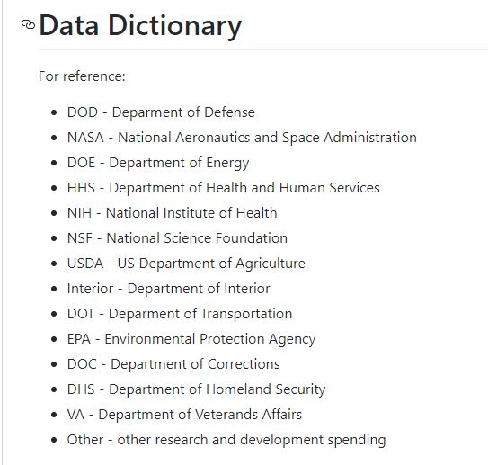
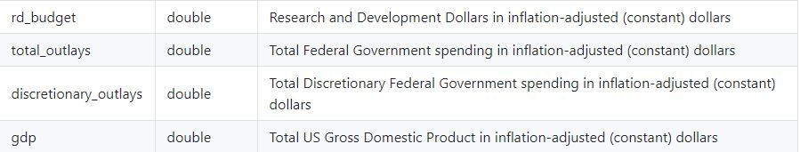

```{r setup, include=FALSE}
knitr::opts_chunk$set(echo = TRUE,fig.width = 10,fig.height = 10,warning = FALSE,message = FALSE)
```


```{r Prepare to Tidyteusday}
# load the packages 
library(readr)
library(tidyverse)
library(gganimate)
library(dplyr)
library(magrittr)

# load the data
climate <- read_csv("climate_spending.csv")

energy <- read_csv("energy_spending.csv", 
                    col_types = cols(year = col_integer()))

federal <- read_csv("fed_r_d_spending.csv")
```

Even though I can go further and do an investigative plotting from the 
rest data it is not done here. I was more focused on the scientific 
notation values in the plotting and scales, which were bothering me
a lot.

3 Data sets are given here, they are 

1. Global Climate Change Research Program Spending. - climate
2. Energy Departments Data. - energy
3. Total Federal R & D Spending by Department. - federal

Oddly though climate data-set did not have year values, I checked the downloaded
csv file and the GitHub upload as well. Well, That did not stop me from doing 
some tidy plotting.

You can obtain the data from [here.](https://github.com/rfordatascience/tidytuesday/tree/master/data/2019/2019-02-12)
It should be noted that I am not going to rename the abbreviation of departments
with their full names, so below is a screen shot which would come in handy.



# Climate Change Research 

As I mentioned earlier for the climate data there are no values in the year column, but according to 
summary I was able to deduce that we have 18 years of information. When we do plot it is going
to be the summation for each department in a bar. 

Clearly NASA has the most amount ( above than 2.5 x 10^10) of spending because rockets are expensive, 
second place goes to NSF (5 x 10^9) and third place to NOAA. Lowest amount of spending is to the 
department of interior (8.47 x 10^8).

```{r Global Climate change Research}
ggplot(climate,aes(x=fct_inorder(department),y=gcc_spending,fill=department))+
  geom_bar(stat="identity",show.legend = FALSE)+
  ggtitle("Total GCC Spending for 18 Years")+
  scale_y_continuous(labels = scales::scientific,breaks = seq(0,2.75e+10,0.25e+10))+
  xlab("Sub Agency / Department")+ylab("GCC Spending (in USD)")
```

# Energy 

Since 1997 to 2018 how Energy Department funding has changed with sub agency/ department. 
Office of Science R & D and Atomic Energy Defense are competitive over the years and for 
a short period of time the latter has less funding than the former, this was between 2006 to 2010.

Other agencies oscillates over the years while reaching new highs and lows. 

```{r Energy Funding}
p<-ggplot(energy,aes(x=department,y=energy_spending,fill=year))+
          geom_bar(stat="identity",position ="identity")+
          transition_time(year)+
          geom_text(aes(label=scales::scientific(energy_spending)),
                    vjust = "inward", hjust = "inward")+
          ease_aes("linear")+coord_flip()+
          ylab("Energy Spending (in USD)")+
          theme(legend.position = "right")+
          xlab("Sub Agency / Department")+
          scale_fill_continuous(breaks = seq(1997,2018,3))+
          scale_y_continuous(labels = scales::scientific)+
          ggtitle("Energy Spending Of Year : {frame_time}")

animate(p,fps=1,nframes=22)
```

# Federal

Data of Federal funding has four different types to be compared and they are mentioned below
in the description image which would make explanation more easier.





Except rd_budget other have a very clear increasing amount between 1976 to 2018. Further,
all four plots have different scales and the limits are widely different for each plot.

```{r Federal Funding}
p<-federal %>%
    gather(funding,amount,c(rd_budget,total_outlays,discretionary_outlays,gdp)) %>%
    ggplot(.,aes(x=factor(department),y=amount,color=year))+
           geom_jitter()+transition_time(year)+
           ease_aes("linear")+coord_flip()+
           shadow_mark()+
           theme(legend.position = "right")+
           ylab("Spending in USD")+xlab("Department")+
           ggtitle("Total Federal R&D for Year : {frame_time}")+
           scale_color_continuous(breaks = seq(1976,2018,6),labels=seq(1976,2018,6))+
           scale_y_continuous(labels = scales::scientific)+
           facet_wrap(~funding,scales = "free")

animate(p,fps=1,nframes=42)
```

*THANK YOU*