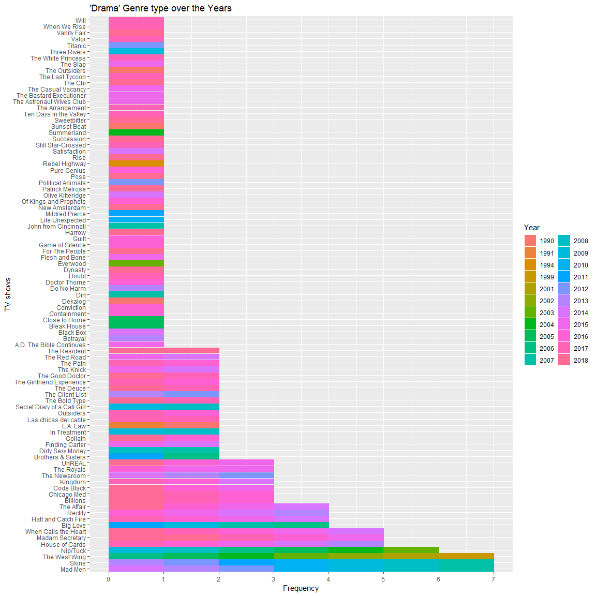

TV\_ratings
================

``` r
# loading the packages
library(tidyverse)
library(summarytools)
library(magrittr)
library(readr)
library(lubridate)
library(gganimate)
library(stringr)

# load the dataset
Ratings <- read_csv("IMDb_Economist_tv_ratings.csv", 
                    col_types = cols(date = col_date(format = "%Y-%m-%d")))
```

[Ratings](https://github.com/rfordatascience/tidytuesday/tree/master/data/2019/2019-01-08) data-set is from the IMDB site. I just found out that IMDb is active from 1990, that is a very long time and new information to me.

TV shows from 1990 to 2018 with their ratings, genres, sharing and aired dates is in this data-set. I wanted a cool function to summarize the data-set at once, therefore scroll through the internet and found the package [summarytools](https://github.com/dcomtois/summarytools). There are quite a few functions in the mix, yet I choose dfSummary.

Below is the code of using that function on the Ratings data-set.

``` r
#Basic summary of all variables
dfSummary(Ratings,style = 'grid')
```

    ## Data Frame Summary   
    ## Ratings     
    ## **Dimensions:** 2266 x 7     
    ## **Duplicates:** 1   
    ## 
    ## +----+---------------+--------------------------------+----------------------+----------------------------------------+--------+---------+
    ## | No | Variable      | Stats / Values                 | Freqs (% of Valid)   | Text Graph                             | Valid  | Missing |
    ## +====+===============+================================+======================+========================================+========+=========+
    ## | 1  | titleId       | 1. tt0098844                   | 20 ( 0.9%)           |                                        | 2266   | 0       |
    ## |    | [character]   | 2. tt0203259                   | 20 ( 0.9%)           |                                        | (100%) | (0%)    |
    ## |    |               | 3. tt0118401                   | 19 ( 0.8%)           |                                        |        |         |
    ## |    |               | 4. tt0108757                   | 15 ( 0.7%)           |                                        |        |         |
    ## |    |               | 5. tt0247082                   | 15 ( 0.7%)           |                                        |        |         |
    ## |    |               | 6. tt0413573                   | 15 ( 0.7%)           |                                        |        |         |
    ## |    |               | 7. tt0452046                   | 14 ( 0.6%)           |                                        |        |         |
    ## |    |               | 8. tt0118375                   | 13 ( 0.6%)           |                                        |        |         |
    ## |    |               | 9. tt0460681                   | 13 ( 0.6%)           |                                        |        |         |
    ## |    |               | 10. tt0460627                  | 12 ( 0.5%)           |                                        |        |         |
    ## |    |               | [ 866 others ]                 | 2110 (93.1%)         | IIIIIIIIIIIIIIIIII                     |        |         |
    ## +----+---------------+--------------------------------+----------------------+----------------------------------------+--------+---------+
    ## | 2  | seasonNumber  | mean (sd) : 3.26 (3.44)        | 27 distinct values   | :                                      | 2266   | 0       |
    ## |    | [numeric]     | min < med < max :              |                      | :                                      | (100%) | (0%)    |
    ## |    |               | 1 < 2 < 44                     |                      | :                                      |        |         |
    ## |    |               | IQR (CV) : 3 (1.05)            |                      | :                                      |        |         |
    ## |    |               |                                |                      | : .                                    |        |         |
    ## +----+---------------+--------------------------------+----------------------+----------------------------------------+--------+---------+
    ## | 3  | title         | 1. Law & Order                 | 20 ( 0.9%)           |                                        | 2266   | 0       |
    ## |    | [character]   | 2. Law & Order: Special Vict   | 20 ( 0.9%)           |                                        | (100%) | (0%)    |
    ## |    |               | 3. Midsomer Murders            | 19 ( 0.8%)           |                                        |        |         |
    ## |    |               | 4. CSI: Crime Scene Investig   | 15 ( 0.7%)           |                                        |        |         |
    ## |    |               | 5. ER                          | 15 ( 0.7%)           |                                        |        |         |
    ## |    |               | 6. Grey's Anatomy              | 15 ( 0.7%)           |                                        |        |         |
    ## |    |               | 7. Criminal Minds              | 14 ( 0.6%)           |                                        |        |         |
    ## |    |               | 8. King of the Hill            | 13 ( 0.6%)           |                                        |        |         |
    ## |    |               | 9. Supernatural                | 13 ( 0.6%)           |                                        |        |         |
    ## |    |               | 10. Bones                      | 12 ( 0.5%)           |                                        |        |         |
    ## |    |               | [ 858 others ]                 | 2110 (93.1%)         | IIIIIIIIIIIIIIIIII                     |        |         |
    ## +----+---------------+--------------------------------+----------------------+----------------------------------------+--------+---------+
    ## | 4  | date          | min : 1990-01-03               | 1808 distinct val.   |                   :                    | 2266   | 0       |
    ## |    | [Date]        | med : 2012-12-07               |                      |                 . :                    | (100%) | (0%)    |
    ## |    |               | max : 2018-10-10               |                      |               . : :                    |        |         |
    ## |    |               | range : 28y 9m 7d              |                      |           . : : : :                    |        |         |
    ## |    |               |                                |                      | . . . . : : : : : :                    |        |         |
    ## +----+---------------+--------------------------------+----------------------+----------------------------------------+--------+---------+
    ## | 5  | av_rating     | mean (sd) : 8.06 (0.67)        | 1997 distinct values |               :                        | 2266   | 0       |
    ## |    | [numeric]     | min < med < max :              |                      |               : :                      | (100%) | (0%)    |
    ## |    |               | 2.7 < 8.11 < 9.68              |                      |               : :                      |        |         |
    ## |    |               | IQR (CV) : 0.76 (0.08)         |                      |             . : :                      |        |         |
    ## |    |               |                                |                      |             : : : .                    |        |         |
    ## +----+---------------+--------------------------------+----------------------+----------------------------------------+--------+---------+
    ## | 6  | share         | mean (sd) : 1.28 (3.38)        | 454 distinct values  | :                                      | 2266   | 0       |
    ## |    | [numeric]     | min < med < max :              |                      | :                                      | (100%) | (0%)    |
    ## |    |               | 0 < 0.32 < 55.65               |                      | :                                      |        |         |
    ## |    |               | IQR (CV) : 0.99 (2.64)         |                      | :                                      |        |         |
    ## |    |               |                                |                      | :                                      |        |         |
    ## +----+---------------+--------------------------------+----------------------+----------------------------------------+--------+---------+
    ## | 7  | genres        | 1. Crime,Drama,Mystery         | 369 (16.3%)          | III                                    | 2266   | 0       |
    ## |    | [character]   | 2. Comedy,Drama                | 174 ( 7.7%)          | I                                      | (100%) | (0%)    |
    ## |    |               | 3. Drama                       | 168 ( 7.4%)          | I                                      |        |         |
    ## |    |               | 4. Action,Crime,Drama          | 146 ( 6.4%)          | I                                      |        |         |
    ## |    |               | 5. Action,Adventure,Drama      | 112 ( 4.9%)          |                                        |        |         |
    ## |    |               | 6. Crime,Drama                 | 107 ( 4.7%)          |                                        |        |         |
    ## |    |               | 7. Drama,Romance               | 86 ( 3.8%)           |                                        |        |         |
    ## |    |               | 8. Comedy,Crime,Drama          | 80 ( 3.5%)           |                                        |        |         |
    ## |    |               | 9. Comedy,Drama,Romance        | 76 ( 3.4%)           |                                        |        |         |
    ## |    |               | 10. Crime,Drama,Thriller       | 63 ( 2.8%)           |                                        |        |         |
    ## |    |               | [ 87 others ]                  | 885 (39.1%)          | IIIIIII                                |        |         |
    ## +----+---------------+--------------------------------+----------------------+----------------------------------------+--------+---------+

Basic summary of seasons indicate 27 distinct values and obviously 1 is the minimum value, but the maximum value is 44. Another odd thing is median for being 2, further the average is 3.26. Which means most of the TV shows have only up-to few seasons.

Summary of date indicates the earliest TV show from 1990 and latest from 2018. So the year difference is 28 years, but there are only 1808 distinct values. Even though the data-set contains 2266 observations. Some TV shows might have to start on the same day, that is only plausible conclusion.

"av\_rating" (I presume Audio/Video Rating) is in the scale from 1 to 10, where people had influence. The least rating value is 2.7 and the most rating value is 9.68, but the median is 8.11. Also the mean is 8.06. We can say most of these TV shows are excellent to watch. There is another numeric variable called share and the value ranges from 0 to 55.65 where the average is 1.28.

Genre
=====

Genres in this data-set has close to 100 distinct factors. The category "Crime,Drama,Mystery" holds the highest percentage of 16.3, while second place is to "Comedy,Drama" with 7.7% and third place is to "Drama" type with 7.4%. All the other types of genre is represented by less than 7%.

Genre and Season
----------------

Genre and Season are two categorical variables which should be compared to find out if over time do people like the same genre type. If we look at the bar plot it is clear "Crime,Drama,Mystery" type has seasons from 1 to 20. Mostly in all genres there is clear sign of TV shows with seasons up-to three or four. Some of them make it to season ten or eleven, for example genres like "Drama", "Drama,Thriller", "Animation,Comedy,Drama" and "Adventure,Drama,Family".

Oddly in "Drama,Romance" and "Crime,Drama" there are TV shows which has seasons above 35 but very few. It becomes more weird where for the same genre types the seasons in-between 25 and 34 are missing. Clearly in the legend also until season 20 there is continuity, but this does not carry on for higher seasons.

``` r
ggplot(Ratings,aes(x=fct_infreq(factor(genres)),fill=factor(seasonNumber)))+
  geom_bar()+ coord_flip()+labs(fill="Season")+
  xlab("Genre")+ylab("Frequency")+
  ggtitle("Genre and Seasons")+
  scale_y_continuous(breaks=seq(0,375,25),labels=seq(0,375,25))
```


Genre and Year
--------------

Bar plot indicates that after 2014 around 90% of these genre type TV shows have been done. In the top ten category according to the counts of TV shows clearly all of these genres have been active since 1990 to now. Some of them were started in mid 1990s which include the genre types "Action,Crime,Drama", "Crime,Drama" and "Comedy,Crime,Drama".

Types such as "Drama,Romance,Sport" and "Adventure,Drama,Romance" were in active in the mid 2000s but no longer. Genres such as "Drama,History", "Drama,Horror,Thriller" and "Action,Drama" are a few of them which were popular after 2012.

``` r
ggplot(Ratings,aes(x=fct_infreq(factor(genres)),fill=factor(year(date))))+
  geom_bar()+ coord_flip()+labs(fill="Year")+
  xlab("Genre")+ylab("Frequency")+
  ggtitle("Genre Over the Year")+
  scale_y_continuous(breaks=seq(0,375,25),labels=seq(0,375,25))
```


Genre and Month
---------------

Month of airing might have an influence on the TV shows. Bar plot indicates that most of the TV shows are aired in the first quarter or last quarter of the year. Which means shows aired in the fall (September or October) or aired after winter break (January).

``` r
ggplot(Ratings,aes(x=fct_infreq(factor(genres)),fill=factor(month(date))))+
  geom_bar()+ coord_flip()+ labs(fill="Month")+
  xlab("Genre")+ylab("Frequency")+
  ggtitle("Genre Over the Months")+
  scale_y_continuous(breaks=seq(0,375,25),labels=seq(0,375,25))
```


Season
======

TV shows may run for few seasons or more most of the time. Some are limited seasons close to four or above, but definitely less than 10. It is very rare to see TV shows going beyond the 15 seasons mark.

Season and Year
---------------

Clearly there is an increase in TV shows aired over the years. All time low occurs in 1992 but all time high occurs in 2017. From 1990 to 2010 the TV shows aired have increased from 25 to 100. By the end of year 2017 the number of shows aired has reached more than 250, but its drops to slightly above 175 the next year. The all time low of less than 12 seasons occurs in 1990.

In the years 1990,1996,2005,2007,2010,2011 and 2015 there are TV shows which has season above 30, but it should be reminded that according to the legend after season 20 there is no continuity.

If we focus closely until 2005 most of the TV shows have seasons up-to 10 , but after 2005 there are TV shows which aired season until 20. This shows the popularity of certain shows over three decades.

``` r
ggplot(Ratings,aes(x=factor(year(date)),fill=factor(seasonNumber)))+
  geom_bar()+ coord_flip()+labs(fill="Season")+
  xlab("Year")+ylab("Frequency")+
  ggtitle("Seasons over the Years")+
  scale_y_continuous(breaks=seq(0,230,10),labels=seq(0,230,10))
```


Season and Month
----------------

Highest amount of more than 500 shows were aired in January and lowest amount of slightly less than 100 was aired in June. Second place goes to February with shows close to 200 being aired this is not even the half of what aired in the previous month. In the months of January, February and September most of the seasons were aired, while in the other months the seasons aired are from the range of 1 to 10. Where very few of them ever reached the double digits or above season 8.

``` r
ggplot(Ratings,aes(x=factor(month(date)),fill=factor(seasonNumber)))+
  geom_bar()+coord_flip()+labs(fill="Season")+
  xlab("Month")+ylab("Frequency")+
  ggtitle("Seasons over the months")+
  scale_y_continuous(breaks=seq(0,550,25),labels=seq(0,550,25))
```


Top 3 Genres
============

Let focus on the most mentioned genre types which are "Crime,Drama,Mystery", "Comedy,Drama" and "Drama". The below section is to graphically represent the TV shows of a certain genre with its seasons and when they were aired.

Therefore I will not be factual, mostly biased towards the shows I watched and special characteristics.

Crime Drama Mystery
-------------------

Law and Order of 20 seasons has been over for more than 5 years and it began airing in 1990. Law and Order Special Victims Unit started airing in 1999 even now its still being aired. There are also odd shows like which has not aired continuously and skipped an year or two. Among them Columbo, Agatha Christie's Marple and II commissario Montalbano are specially noted.

There are lot of shows which only aired one or two seasons only and then stopped. They also can be noted from the bar plot. In the legend there are colors to indicate all the years from 1990 to 2018 through color.

``` r
subset(Ratings,genres=="Crime,Drama,Mystery") %>%
  ggplot(aes(x=fct_infreq(title),fill=factor(year(date)),color=factor(year(date))))+
    geom_bar()+ coord_flip()+labs(color="Year",fill="Year")+
    xlab("TV shows")+ylab("Frequency")+
    ggtitle("'Crime,Drama,Mystery' Genre type over the Years")+
    scale_y_continuous(breaks=0:20,labels=0:20)
```


Comedy Drama
------------

Similarly as above we can interpret the bar plot as well. But here the highest amount of seasons any TV show has reached is 9. Only the TV shows "Scrubs" and "Shameless" have reached that milestone and both of them begin in different decades. "Scrubs" began in early 2000s, but "Shameless" was aired after 2010.

In the years 1998 and 1999 there were no TV shows aired under the genre "Comedy,Drama".

``` r
subset(Ratings,genres=="Comedy,Drama") %>%
    ggplot(aes(x=fct_infreq(title),fill=factor(year(date)),color=factor(year(date))))+
    geom_bar()+ coord_flip()+labs(color="Year",fill="Year")+
    xlab("TV shows")+ylab("Frequency")+
    ggtitle("'Comedy,Drama' Genre type over the Years")+
    scale_y_continuous(breaks=0:9,labels=0:9)
```


Drama
-----

Most of the TV shows in this genre type are limited to one season an a few more with 2 seasons. Even though most of them were aired after 2015. TV shows "Mad Men", "Skins" and "The West Wing" has aired for 7 seasons.

Some of these shows were limited series like "The News Room". The only very early TV show is "Rebel Highway" which was aired in 1994 and in year 2004 "Summerland" was aired, where both of them were limited to one season.

According to the legend the years 1992,1993,1995 to 1998 were years free of "Drama" genre TV shows.

``` r
subset(Ratings,genres=="Drama") %>%
 ggplot(aes(x=fct_infreq(title),fill=factor(year(date)),color=factor(year(date))))+
    geom_bar()+ coord_flip()+labs(color="Year",fill="Year")+
    xlab("TV shows")+ylab("Frequency")+
    ggtitle("'Drama' Genre type over the Years")+
    scale_y_continuous(breaks=0:7,labels=0:7)
```



Rating over the years
=====================

Lets discuss regarding TV shows and their rating over the years with related to sharing. Clearly we can see the number of shows of increasing from 1990 to 2018. Oddly there was more sharing related to movies before 2000, this is into the same over the next years. To be honest sharing becomes more extinct.

In perspective of rating the range is very much centered and small(between 7.5 - 9), but over the years this changes and expands to a wider range.(6.5 - 9.5). Only a handful of TV shows are rated below 5 in the scale over the year span of 28.

``` r
p<-ggplot(Ratings,aes(x=factor(year(date)),y=av_rating,color=genres,size=share))+
      geom_point(show.legend = FALSE)+ 
      labs(title = "Ratings and Sharing : {frame_time}"
           ,x="Year",y="Rating")+
      scale_y_continuous(breaks=2:10,labels=2:10)+
      transition_time(date)+ease_aes('linear')+
      theme(axis.text.x = element_text(angle = 90))+
      shadow_mark()

animate(p,fps= 5,duration =60)
```


Tv Series with more than 14 Seasons
===================================

This is simply me trying to focus on the TV shows which has seasons more than 14 and their rating, sharing changes over the years.

``` r
p<-subset(Ratings,title=="CSI: Crime Scene Investigation"|
          title=="ER"| title=="Grey's Anatomy"| title=="Midsomer Murders"| 
          title=="Law & Order"|
          title=="Law & Order: Special Victims Unit") %>%
ggplot(aes(x=seasonNumber,y=av_rating,color=title,size=share))+ 
      geom_point()+
      labs(title = 'Season and Rating Year: {frame_time}',
           x="Season",y="Rating")+
      scale_x_continuous(breaks=1:20,labels=1:20)+
      #scale_y_continuous(breaks=)
      transition_time(date)+ease_aes('linear')+
      shadow_mark()+theme(legend.position = "bottom")

animate(p,fps=5,duration = 60)
```


