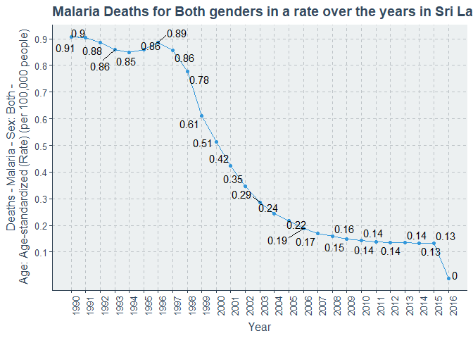

Malaria deaths
================
M.amalan
November 13, 2018

Packages : ggplot2, ggrepel, ggthemr TidyTuesday : week 33 Data: malaria\_deaths

Malaria\_deaths\_plot: Plot shows the death rate per 100,000 people in sri lanka decreasing rapidly from 1996 to 2003 with a drop of 0.89 to 0.24, and by 2016 it reaches 0. While in 2015 this rate is 0.13. Highest death rate was in 1990 with 0.91.

``` r
#data subset has been used
#scales of x and y have been more scrutinized
#labels have been added
#x axis have been modified to accomodate the years 
Malaria_deaths_plot<-ggplot(subset.data.frame(malaria_deaths,Code=="LKA"),
                      aes(x=Year,y= `Deaths - Malaria - Sex: Both - Age: Age-standardized (Rate) (per 100,000 people)`,
                      label=round(`Deaths - Malaria - Sex: Both - Age: Age-standardized (Rate) (per 100,000 people)`,2)))+
                      geom_point()+geom_line()+geom_text_repel()+
                      ggtitle("Malaria Deaths for Both genders in a rate over the years in Sri Lanka")+
                      ylab("Deaths - Malaria - Sex: Both -\n Age: Age-standardized (Rate) (per 100,000 people)")+
                      scale_y_continuous(breaks=seq(0.1,1,by=0.1) ,labels=seq(0.1,1,by=0.1))+
                      scale_x_continuous(breaks=seq(1990,2016),labels =seq(1990,2016))+
                      theme(axis.text.x = element_text(angle = 90))

print(Malaria_deaths_plot)
```



``` r
ggsave(Malaria_deaths_plot,width = 10,height = 10,dpi=300,filename = "Malaria_Deaths_Sri Lanka.png")
```

Data: malaria\_deaths\_age Malaria\_deaths\_age\_plot: There are five categories in concern,where age category 15-49 has the most counts of in the range of 45-50. Second category is Under 5 close to 35 counts, while third category is 50-69 inbetween 20-25 from year 1990 to 1993. At the end of year 2015 this is not the case, where the categories and counts are 15-49 (close to 10), 50-69 (less than 10), 70 or order(close to 5), under 5(less than 5) and finally 5-14 (close to 0).

``` r
#data subset has been used
#according to age group colors are assigned
#scales of x and y have been more scrutinized
#labels have been added
#x axis have been modified to accomodate the years 
Malaria_deaths_age_plot<-ggplot(subset.data.frame(malaria_deaths_age,code=="LKA"),
                                aes(x=year,y=deaths,color=factor(age_group)))+
                         geom_point()+geom_line()+
                         ggtitle("Malaria Deaths by age category in Sri Lanka over the years")+
                         ylab("Deaths Count")+
                         scale_x_continuous(breaks=seq(1990,2016),labels =seq(1990,2016))+
                         scale_y_continuous(breaks=seq(0,60,by=5) ,labels=seq(0,60,by=5))+
                         theme(axis.text.x = element_text(angle = 90))+
                         scale_color_discrete(name="Age Category")

print(Malaria_deaths_age_plot)
```


``` r
ggsave(Malaria_deaths_age_plot,width=10,height = 10,dpi = 300,filename = "Malaria Deaths Sri Lanka by Age.png")
```
